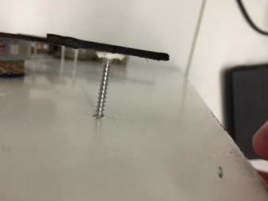

#Thunderbirds und die Internetversorgung aus dem All

# 1. Projekt
Ziel dieses Projektes war es Studierende, aus anderen Fakultäten von der Informatik und somit auch den dazugehörigen Studiengängen, zu überzeugen.
Das Projekt hat 15 Wochen gedauert.
Die Unterteilung dieses Projekts erfolgte in 2 Phasen.
 * Design Thinking 
 * Umsetzung der Idee

---
 
# 2. Einleitung
                                                  POV
 Lisas Stimmung wird beim Betreten des Gebäudes gedrückt, weil sie sich nicht mit der Informatik identifizieren kann.
 
---

# 3. Material und Werkzeug

#### Material (technisch)
* Arduino Uno (2)
* Kabel (Anzahl)
* Photoresistoren (6)
* Widerstände 100 kOhm (5)
* Widerstände 10 Ohm (6) 
* Lötzinn
* Sekundenkleber (4 g)
* Kleber („kleben statt bohren“)
* 5m LED Strip
* Lötplatine (10 cm x 10 cm)
* Atari 2600 - Quickjoy SV 127 TopStar Joystick (1)

#### Material
* Spanplatte (100cm x 60cm x 2cm)
* Holz (50cm x 50cm x2cm), ausgesägte Kontinente
* Dünnes Holz (2qm), ausgesägte Kontinente
* Holzstab (87cm x 5cm x 2cm)
* Schleifpapier (Stärke?)
* Cremetuben (6)
* Durchsichtiges Plexiglas (50cm x 125cm x 2mm)
* Lackspray schwarz matt
* Lasermodul [Conrad.de] (https://www.conrad.de/de/lasermodul-punkt-rot-1-mw-laserfuchs-lfd650-1-12-9x20-816476.html)
* Schrauben (22)
* Auto-K Transparent-Spray Special schwarz (Art.-Nr. 33117, 2 Dosen)

#### Werkzeug
* Lötkolben
* Bohrmaschine
   * Aufsätze: ??
* Akkubohrer 
* Schere
* Teppichmesser
* Zange
* Feile
* Schwarzes Isolierband
* Feine Säge
* Stichsäge 
* Kreissäge -> Werkstatt an der HS
* 3. Hand zum Löten

---

# 4. Vorbereitung

#### Was muss vor dem Start gemacht werden?
* Kauf der LED Strips
* Holz besorgen
* Kleber kaufen
* Fehlendes Werkzeug organisieren
* Joystick kaufen

#### Downloads
1. Bibliothek PololuLedStrip herunterladen. [Download](https://github.com/cbm-instructions/thunderbirds/tree/master/libraries/PololuLedStrip)
2. IDE Arduino herunterladen. [Download](https://www.arduino.cc/en/Main/Software)
3. Schaltplan LED Strip. [Download](https://github.com/cbm-instructions/thunderbirds/blob/master/Schaltpläne/Thunderbirds_Schaltplan_Board.png)
4. Schaltplan Joystick + Laser. [Download](https://github.com/cbm-instructions/thunderbirds/blob/master/Schaltpläne/Thunderbirds_Schaltplan_Joystick_Board.png)
5. Code für das LED Strip und die Weltkarte. [Download](https://github.com/cbm-instructions/thunderbirds/tree/master/src/Laser_Photoresistor_LED)
6. Code für den Joystick und Laser. [Download](https://github.com/cbm-instructions/thunderbirds/tree/master/src/Joystick_Laser_Final)

[kompletter Download als zip](https://github.com/cbm-instructions/thunderbirds.git)

#### Liste mit benötigten Kenntnissen?
* Zur Programmierung wird nur die Arduino interne Programmiersprache verwendet. (C) 
* Umgang mit dem Lötkolben sind von Vorteil.

---

# 5. Step-by-Step-Guide

#### 1. Schritt: 
Eine Holzspanplatte der Größe 50cm x 50cm dient als die Grundfläche für die Karte. Das Holz ist weiß.

### 2. Schritt: 
Eine weitere dicke (2 cm) Holzplatte für den unteren Zuschnitt der Kontinente. An die zugeschnittenen Kontinente wird das LED Strip geklet

### 3. Schritt: 
Dünnes Holz (Rückenwand eines Schranks) für das detaillierte Zuschneiden der Kontinente.

### 4. Schritt:
Die Kontinente werden auf die Spanplatte unter Verwendung einer Vorlage gezeichnet.

### 5. Schritt:
Die vorgezeichneten Kontinente werden anschließend mit der Bandsäge und Stichsäge ausgeschnitten.

### 6. Schritt:
Die ausgeschnittenen Kontinente werden mit Hilfe einer Feile verwendet.
Tipp: Die Kontinente müssen nicht detailliert ausgeschnitten werden. 

### 7. Schritt:
Die zugeschnittenen Kontinente werden auf die Basis Spanplatte (100cm x 60cm x 2cm) gelegt. 

### 8. Schritt:
Die Konturen der zugeschnittenen Kontinente werden mit einem Stift gezeichnet damit eine Befestigung erfolgen kann.

### 9. Schritt:
Die Kontinente werden nun mit Schrauben von hinten befestigt. Der Akkubohrer reicht in diesem Fall aus.

### 10. Schritt:
Erneut werden die Kontinente unter Verwendung der Vorlage auf das dünne Holz gezeichnet. Mit Hilfe einer Stichsäge werden die Kontinente ausgeschnitten.
Achtung: Konturen der Kontinente müssen sehr detailliert sein.

### 11. Schritt:
Kontinente mit der Spraydose schwarz matt lackieren.

### 12. Schritt:
Die getrockneten Kontinente werden auf die befestigten Kontinente gelegt und es wird „zentral“ ein Loch, dass durch alle 3 Platten geht. Für die Bohrung wird eine Bohrmaschine mit einem Holz Bohraufsatz verwendet.

### 13. Schritt:
Nun kann das LED Strip an den Kontinenten befestigt werden. Das LED Strip wird an den markierten Stellen geschnitten und gelötet. Das LED Strip wird mit Sekundenkleber befestigt.

### 14. Schritt:
Die dünnen schwarzen Kontinente werden mit dem Kleber („kleben statt bohren“) auf die Kontinente geklebt.

### 15. Schritt:
Die Cremetuben werden einmal bis zum Deckel geschnitten. Anschließend mit dem Kleber „kleben statt bohren“ bestrichen und von hinten in die Löcher der Kontinente geschoben und mit einem Edding von vorne ausgebreitet.
Tipp: Sollte die Tube nicht perfekt kleben, einfach nochmal mit Sekundenkleber nachhelfen und erneut mit dem Edding ausgebreitet.

### 16. Schritt:
Um die kleinen Inseln befestigen zu können wurden Schrauben in die Basis Holzplatte geschraubt und mit dem Kleber „kleben statt bohren“ festgeklebt.

### 17. Schritt:
An die Photoresistoren werden Kabel dran gelötet und eins der Beinchen des Photoresistors wird mit Isolierband abgeklebt. Anschließend werden die Photoresistoren in die Cremetuben gesteckt.

### 18. Schritt:
Als nächstes wird der Satellit gebaut. Dafür wird erneut das dünne Holz verwendet. Es werden 5 Quadrate mit den Maßen 8cm x 8cm zugeschnitten.

### 19. Schritt:
Es wird das Glas einer Taschenlampe auf das erste Servo geklebt. Darauf kommt das zweite Servo. Zum Schluss wird die Laseriode auf das zweite Servo geklebt.

### 20. Schritt:
Es werden 3 Plexiglas Platten (100cm x 7cm x 2mm) geschnitten. Diese müssen anschließend mit Heißkleber zusammen geklebt werden.

### 21. Schritt:
Das Zusammengeklebte Plexiglas wird mit schwarzem transparenten Spray lackiert.

### 22. Schritt:
Es wird ein Stück Holz an der Basis Holzplatte mit dem Kleber "kleben statt kleben" befestigt.

### 23. Schritt:
Ein Holzstab wird an zwei Eckseiten abgefeilt, an das kleine Stück Holz mit zwei Schrauben befestigt und in das Plexiglas Dreieck geschoben.

### 24. Schritt:
Zum Schluss werden die Kabel auf eine Platine (10cm x 10cm) gelötet.
Die genaue Verlötung sieht man auf dem Schaltplan.

### 25. Schritt:
Sollte keine Platine verwendet werden kann auch ein Board verwendet werden und nach folgendem Schaltplan gesteckt werden.

---

# 6. Ausblick
* LED Strip in die Halterung einbauen, als Sternenhimmel.
* Satellit mit einem 3D Drucker drucken lassen.

